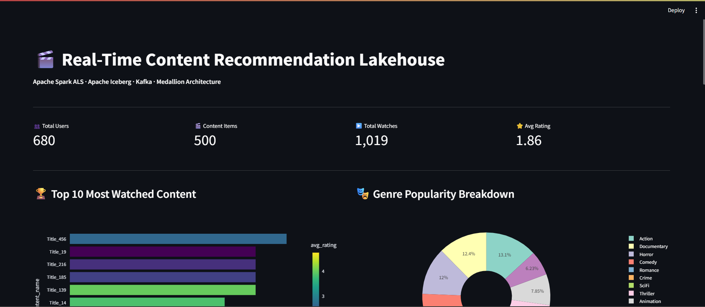
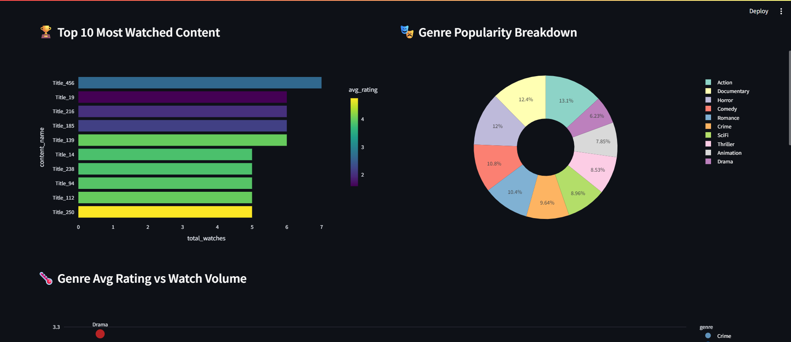

# 🎬 Real-Time Content Recommendation Lakehouse

<p align="center">


</p>

<p align="center">
Enterprise-Scale Real-Time Content Recommendation Platform built using Apache Kafka, Spark Structured Streaming, Apache Iceberg, Airflow, FastAPI, Redis and AWS.
</p>

---

## 📸 Project Preview

<p align="center">
  
</p>

---

# 📑 Table of Contents

- Overview
- Business Problem
- Architecture
- Technology Stack
- Medallion Architecture
- Recommendation Engine
- Analytics Dashboard
- Monitoring
- Repository Structure
- Getting Started
- Future Enhancements

---

# 📌 Overview

A production-inspired Lakehouse architecture for real-time content recommendations powered by Apache Kafka, Apache Spark, Apache Iceberg, Airflow, FastAPI, Redis and AWS.

## Key Features

- Real-time event ingestion
- Spark Structured Streaming
- Medallion Architecture (Bronze, Silver, Gold)
- Apache Iceberg Lakehouse
- Collaborative Filtering using ALS
- FastAPI recommendation serving
- Redis caching
- Streamlit analytics dashboard
- Prometheus and Grafana monitoring

---

# 🏗️ Architecture

```text
Users
  │
  ▼
Kafka
  │
  ▼
Spark Streaming
  │
  ├── Bronze
  ├── Silver
  └── Gold
  │
  ▼
Apache Iceberg
  │
  ▼
ALS Recommendation Engine
  │
  ▼
FastAPI + Redis
  │
  ▼
Analytics Dashboard
```

---

# 🛠 Technology Stack

| Layer | Technology |
|---------|------------|
| Streaming | Apache Kafka |
| Processing | Apache Spark |
| Storage | Apache Iceberg |
| Data Lake | AWS S3 |
| ML | Spark MLlib ALS |
| API | FastAPI |
| Cache | Redis |
| Monitoring | Prometheus + Grafana |
| Dashboard | Streamlit |
| Orchestration | Apache Airflow |

---

# 🥉🥈🥇 Medallion Architecture

### Bronze Layer
- Raw event ingestion
- Historical replay
- Data lineage

### Silver Layer
- Data cleansing
- Sessionization
- Validation

### Gold Layer
- ML-ready features
- User-item matrices
- Recommendation features

---

# 🤖 Recommendation Engine

ALS (Alternating Least Squares) based collaborative filtering.

### Signals Used

| Signal | Weight |
|----------|----------|
| Completion Rate | 1.0 |
| Rating | 0.9 |
| Watch Duration | 0.7 |
| Click | 0.4 |
| Search Match | 0.3 |

---

# 📊 Analytics Dashboard

Interactive Streamlit dashboard for content analytics and recommendation insights.

<p align="center">
  
</p>

### Dashboard Insights

- 🏆 Top 10 Most Watched Content
- 🎭 Genre Popularity Breakdown
- 🌡️ Genre Rating vs Watch Volume Analysis
- 📈 Content Performance Tracking
- 🎯 Recommendation Effectiveness Monitoring

---

# 📈 Monitoring & Observability

- Prometheus Metrics
- Grafana Dashboards
- Spark History Server
- Airflow Monitoring
- FastAPI Metrics

---

# 📂 Repository Structure

```text
content-recommender/
│
├── producers/
├── spark_jobs/
├── api/
├── airflow/
├── dashboard/
├── Screenshots/
│   ├── 1.png
│   └── 2.png
├── docker-compose.yml
├── requirements.txt
└── README.md
```

---

# ⚙️ Getting Started

```bash
git clone https://github.com/Jaskirat8904/Content-Recommendation-System.git
cd Content-Recommendation-System

pip install -r requirements.txt

docker-compose up -d
```

---

# 🎯 Engineering Highlights

✅ Real-Time Data Pipelines

✅ Lakehouse Architecture

✅ Distributed Stream Processing

✅ Recommendation Systems

✅ FastAPI Microservices

✅ Redis Low-Latency Caching

✅ Monitoring & Observability

---

# 🔮 Future Enhancements

- Hybrid Recommendation Models
- Vector Search
- Kubernetes Deployment
- Feature Store Integration
- Deep Learning Ranking Models
- Real-Time Feature Serving

---

# 👨‍💻 Author

**Jaskirat Singh**

GitHub: https://github.com/Jaskirat8904

⭐ If you found this project useful, consider starring the repository.
